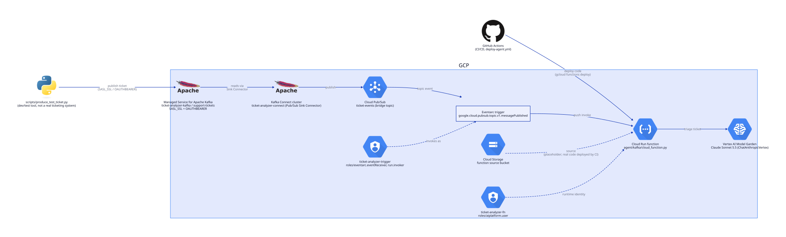

# Ticket Analyzer Agent

A small LangGraph agent that triages incoming support tickets — assigns a priority, then
either resolves the ticket itself, assigns it to a team, or closes it as unsupported — kicked
off by ticket events arriving on a Kafka topic.

Heads up: this is a demo, not something we run in production. It's here to show a particular
way of building an event-driven agent — the same agent code running behind two different
Kafka transports depending on where it's deployed, the full record riding in the event
instead of a lookup tool, and a real (if minimal) GCP deployment. See the bottom of this doc
for what's deliberately left out.

## Architecture



A ticket lands on the `support-tickets` topic and the agent picks it up one of two ways,
depending on environment:

- **Local dev**: `agent/kafka/listener.py` polls a local Kafka broker (`docker-compose`) with
  a plain `KafkaConsumer` loop.
- **GCP**: Eventarc has no native Managed Kafka trigger source (confirmed against a live
  project — `managedkafka.googleapis.com` isn't a registered Eventarc provider), so a Kafka
  Connect Pub/Sub Sink Connector mirrors the topic into a Pub/Sub topic, and *that* fires the
  Eventarc trigger that pushes the message to `agent/kafka/cloud_function.py`, deployed as a
  Cloud Run function.

Either way, both entry points decode the same wire format and hand off to the same
`agent/processor.py` → `agent/graph.py` agent — Kafka transport is the only thing that
changes between local and GCP.

## The whole ticket rides in the event

There's no `get_ticket_data` tool, and no ticket database the agent queries. The Kafka
message *is* the ticket — subject, description, customer, product, category, all of it — and
`agent/processor.py` drops that JSON straight into the prompt. The agent never looks anything
up; it just reasons over what it was handed.

The only local storage (`scripts/tickets.json`, via `agent/store/ticket_store.py`) is where
the three terminal tools record their outcome — priority, status, resolution — keyed by
ticket id. It upserts rather than requiring the ticket to already exist there, since with
this design a ticket id can show up for the first time via Kafka with no prior record at all.

## Exactly one terminal action, every time

The system prompt in `agent/graph.py` is deliberately narrow: assign a priority
(Critical/High/Medium/Low based on customer impact and urgency), then call exactly one of
three tools —

- `auto_resolve_ticket` — well-understood, self-service issue the agent can fully answer
  itself (how-tos, documented workarounds, account/password guidance).
- `assign_ticket` — needs a human with system access or judgement (bugs, billing disputes,
  security incidents), routed to one of five fixed teams.
- `close_as_not_supported` — out of scope, unsupported, or spam.

No open-ended tool loop, no "keep going until you feel done." One ticket in, one decision
out, every time.

## Claude via Vertex AI, not a direct API key

The model call goes through `langchain_google_vertexai.ChatAnthropicVertex`, hitting the
Claude Sonnet 5.5 deployment enabled in Vertex AI Model Garden. There's no
`ANTHROPIC_API_KEY` anywhere — auth is Application Default Credentials
(`gcloud auth application-default login` locally, the function's own service account on
GCP), same pattern as the rest of the project's GCP access.

## Running locally

```bash
uv sync
cp .env.example .env   # fill in GCP_PROJECT_ID, run `gcloud auth application-default login`
docker compose -f scripts/docker-compose.yml up -d
uv run ticket-analyzer-agent-demo              # starts the polling listener
uv run python scripts/produce_test_ticket.py   # publishes every ticket in scripts/tickets.json
```

The producer script works against either broker — set `KAFKA_SECURITY_PROTOCOL=SASL_SSL` and
point `KAFKA_BOOTSTRAP_SERVERS` at a real GCP cluster to test against Managed Kafka instead of
the local one; it switches to OAUTHBEARER auth (`agent/kafka/gcp_oauth.py`) automatically.

## Running on GCP

Terraform (`terraform/`) provisions most of it:

- `google_managed_kafka_cluster` / `google_managed_kafka_topic` — the `support-tickets` topic
  on Managed Service for Apache Kafka.
- `google_pubsub_topic.ticket_events` — the Pub/Sub bridge topic Eventarc actually triggers
  off (`terraform/pubsub.tf`), plus the IAM to let the Kafka Connect service agent publish to
  it and let Pub/Sub mint invocation tokens as the trigger's service account.
- `google_cloudfunctions2_function` (branded "Cloud Run functions", same API either way) with
  an Eventarc trigger on that Pub/Sub topic, plus two purpose-scoped service accounts:
  `ticket-analyzer-fn` (`roles/aiplatform.user`, so the function can call Vertex) and
  `ticket-analyzer-trigger` (`roles/eventarc.eventReceiver` + `run.invoker`, so Eventarc can
  invoke it).
- A GCS bucket holding a placeholder deploy — Terraform only creates the function, it doesn't
  own the code.

The Kafka Connect cluster and its Pub/Sub Sink Connector are **not** in Terraform — there's no
`google_managed_kafka_connect_cluster` or `_connector` resource yet (checked against the live
provider schema). Run `terraform/setup-kafka-connect.sh` by hand after `apply`, once the Kafka
cluster is `ACTIVE`.

GitHub Actions (`.github/workflows/deploy-agent.yml`) does the actual code deploys: it's
path-filtered to `agent/**`, and runs `gcloud functions deploy` without touching trigger or
IAM config, so it can't accidentally drift what Terraform manages.

## What's missing, on purpose

- The Managed Kafka bootstrap address isn't something Terraform can output — neither the
  resource nor any data source exposes it (checked against the live provider schema, not
  assumed). You fetch it by hand once the cluster is `ACTIVE`:
  `gcloud managed-kafka clusters describe <cluster> --location=<region> --format='value(bootstrapAddress)'`.
- The Pub/Sub Sink Connector's class name
  (`com.google.pubsub.kafka.sink.CloudPubSubSinkConnector`, in
  `terraform/setup-kafka-connect.sh`) is inferred by symmetry with the *source* connector
  class Google's own `gcloud managed-kafka connectors create --help` example uses — not
  directly confirmed against a live connect cluster.
- The Kafka Connect cluster is a second billed Managed Kafka resource (another 3 vCPU / 3 GiB
  minimum) that exists purely to bridge around Eventarc's lack of a native Kafka source — real
  cost and moving parts added just to keep the push/serverless model instead of running a
  polling consumer.
- `scripts/tickets.json` is a flat file, not a database — fine for a demo, but the Cloud Run
  function's copy lives on ephemeral `/tmp` and doesn't persist or share across instances.
- No automated tests — correctness so far has been checked by hand: real tickets through the
  local Kafka transport, synthetic CloudEvents through the Cloud Run handler (no live Eventarc
  trigger has fired against it yet).

All fixable, just not the point of this project.

---

**Need this reliable in production, not just as a demo?** [Arul Systems](https://www.arulsystems.com/)
helps customers build reliable agents quickly, at scale. [Get in touch](https://www.arulsystems.com/contact).
